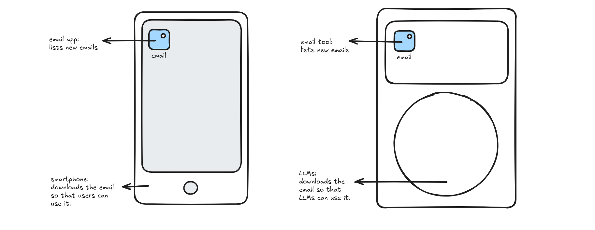

The next app store will provide tools to large language models (LLMs).

While I was taking the shower, I couldn't help myself but draw parallels between the operating systems and LLMs. The first time Andrej Karpathy, a Slovak-Canadian computer scientist, presented this idea, I didn't fully grasp the depth of the explanation and just waved it off as another minor lesson. But after picking up LangGraph (a framework for building complex AI agents) and building complex agentic systems, I started to get a clearer picture. It stuck in my mind until eventually realizing how LLMs could get adopted 3-5 years from now. And I'm very excited to see how this plays out. 

Hopefully this graphical representation is helpful and helps highlight similarities. When an iPhone user wants to check their email, perhaps it's best to first download an email client from the App Store. So now the iPhone has more features! Not only can it now call, but you can now check emails!

This is the same for LLMs. When you use LLMs without giving it tools, it's pretty weak. For example, a barebones LMM can't search the internet or remember your previous messages. From a user's standpoint, it's pretty pathetic. 

But what makes it strong is that you can give tools that LLMs can work with. When programming LLMs, I wouldn't stop at just initializing the LLMs; that's absurd! I would incorporate tools that chatbots can call to make it more versatile (e.g. adding search capabilities, calculators, or email access). 

---
 

I don't own a glass ball, but there's actually a surprising startup lesson here. 

Don't build the chatbots, start building the tools. My vision is that people will own their personal chatbots just like they own an iPhone. So when the time comes, growing their personal chatbot's capabilities will be an integral part.

Best regards,
Yvon Kim